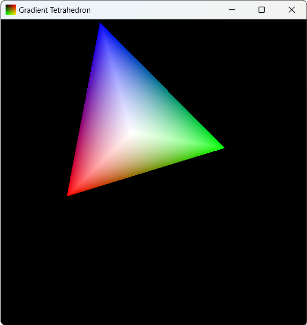
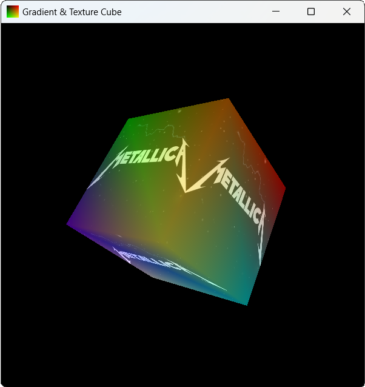
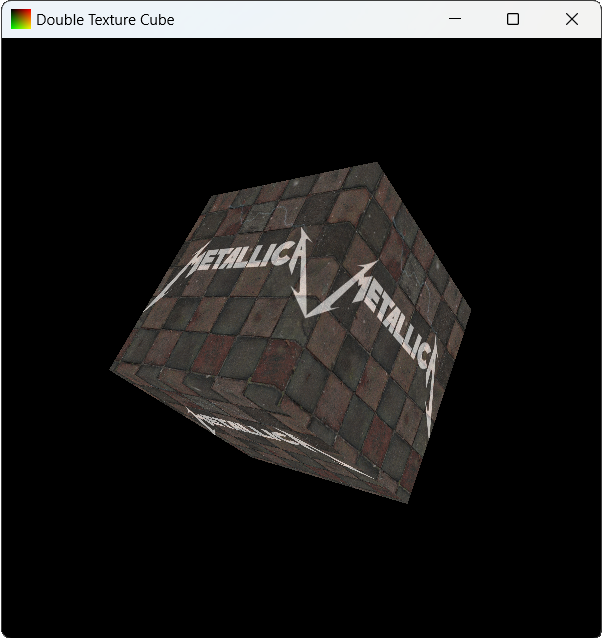
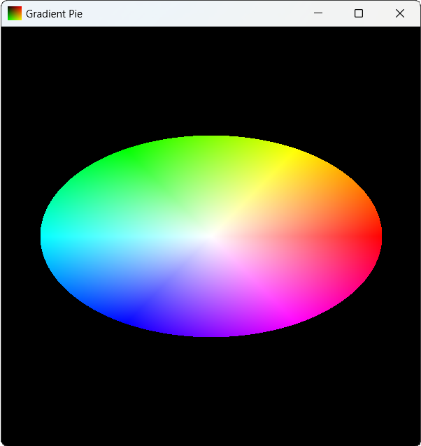

# Лабораторная работа № 12. Атрибуты, юниформы и трёхмерные объекты в OpenGL. Наложение текстур
##
1. Градиентный тетраэдр, который можно двигать вдоль осей кнопками клавиатуры. Он должен быть повёрнут так, чтобы было видно, что это тетраэдр.
2. Кубик с наложенной на него текстурой. Текстура должна быть смешана с цветами, пропорция регулируется кнопками клавиатуры.
3. Кубик с двумя смешанными текстурами. Пропорция должна регулироваться кнопками клавиатуры.
4. Градиентный круг (окружность проходит Hue из HSV, центр белый), который можно масштабировать по осям (каждую ось своей кнопкой).
## Демонстрация работы

